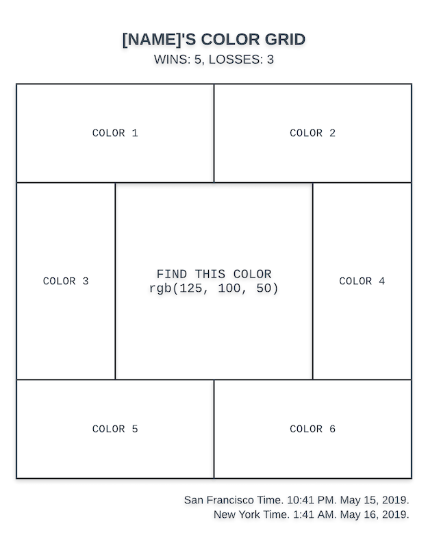

# Instructions to run the app is inside Instruction.txt

# Color Carnival Homework

## Overview

You are making one application with a React frontend for the game and a NodeJS backend for the API. Instructions are specific when they need to be, but are also left intentionally vague in areas so that you may choose what's comfortable to you. The frontend and backend can be either combined or separate Node applications.

## API

Develop a NodeJS web server with the following requirements:

1. All coding work must be done in this repository.
2. Homepage route (`/`) that has a login for a username and password. The login check can just be a simple check against a variable on the server. For the frontend, I recommend using `localStorage` or a cookie to fake logins once the request comes back to the server that username and password is valid.
3. Game route (`/game`) that requires a login. If the user isn't logged in, they're simply redirected to the homepage.
4. API route(s) to handle the game. The routes live on the same server and are named appropriately.
5. A logout route (`/logout`) that logs the user out and redirects to the `/` route.

Please `git commit` and `git push` at least every 30-60 minutes to the repository. The commits are not being judged and they're only there for understanding the process and time-keeping. Feel free to use any framework.

If you end up wanting to do more work than over a day, please check in and let me know. The work will be graded and understood more holistically on the final product than something timed on a much tighter timeline.

## Game Frontend

The game you're making is a simple color-matching game where the player is presented with an RGB value and they must click on the matching color area. Upon clicking a color area, it will give the user feedback that it was correct or wrong and reset the game with all of the data updated. The name, win, and loss data are stored in the *backend* of the application (which may just be an in-memory object or off-app storage) and is reset upon login.

The game looks like the following:

When the user loads the page, *the data above is provided by the server*. This includes the following (from the server):

- logged in user's name for the header
- their current wins and losses
- the current random RGB color they're trying to match (show with FIND THIS COLOR in the center objective area)
- 6 color areas that have random RGB values as their background color with one of the areas having the correct color that the player is trying to match (correct position should be randomized)
- the time in San Francisco and New York (use [momentJS](https://momentjs.com/) in the backend to accomplish this)

Upon clicking any color area, it `POST`s to the backend whether it was correct (you can use the frontend to determine correctness), updates the backend data for wins/losses accordingly, and resets the game without a page reload with the above data coming from the backend (make sure to update wins/losses, current random RGB color, the 6 color areas, and San Francisco and New York times to the frontend).

In addition, create a logout button (that fires the `/logout` route) in the top right of the game and a login page that accepts a username and password when the user isn't logged in.

The container can be any fixed square width and height values, so no need to factor in responsive design unless you want to. The color areas are equal in size, some are just horizontal and others are vertical. Beyond that, feel free to style the above in whatever colors, typography, etc. that you want--we look forward to seeing the final application!

Feel free to use any React framework or boilerplate.

Bonus points if you end up using off-app storage such as a database, Firebase, etc.
